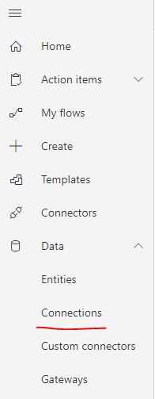
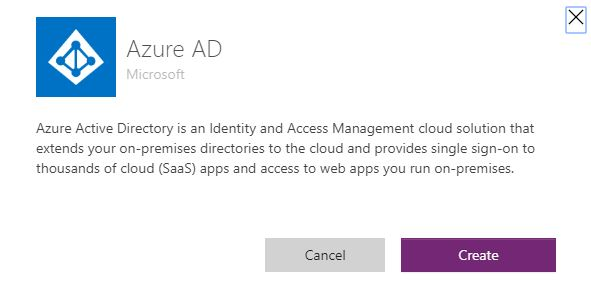
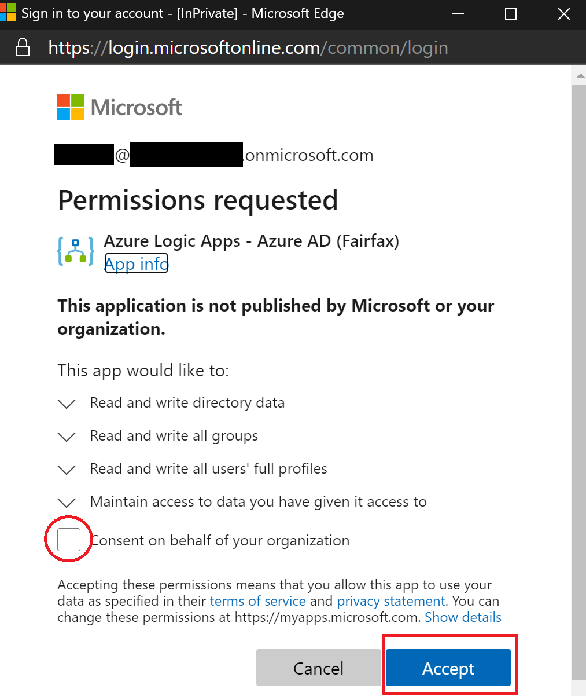

# Enable Azure AD Connector in GCC
To use the Azure AD connector in Power Platform a tenant Global Admin needs to first consent for the organization to be able to use the connector.  Below are the steps to enable this for a tenant.

* Go to the Power Automate service
* Go to the Connections page (Data > Connections)

* Create a new connection
* Find the Azure AD connector and create a new connection

* Sign in with your Global Admin credentials and make sure to check the box for the entire organization

