# Electronic Signatures using CDS File Field Type
I put this sample together to show how you can create a Power Apps canvas app to capture a users signature and then save it to a CDS record.  This solution also allows you to avoid using a 3rd party solution to capture the signature portion.

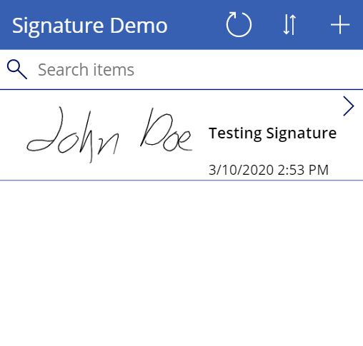

## Sample Solution File
You can download the sample solution for this here to play around with yourself in Power Apps!

[Signature Demo Solution File](https://github.com/SteveWinward/PowerApps/raw/master/WriteUps/Samples/DigitalSignatureDemo_1_0_0_1.zip)

Details on importing solution files can be found on our online docs below,

[Import Solutions Docs](https://docs.microsoft.com/en-us/powerapps/maker/common-data-service/import-update-export-solutions)

## File Field Types in CDS
This solution leverages the new File field type in CDS to save the captured Pen Ink signature input and save it.  

## Creating this Solution

### Creating the Signature Entity
Create a new custom entity called Signature.

Add two new custom fields (neither has to be required fields)

* Signature Image => File field type
* Signature Date => Date and Time type

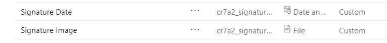

### Create the Canvas App
Create a new Canvas App in your Power Apps environment.  Then add a new edit form to the first screen.

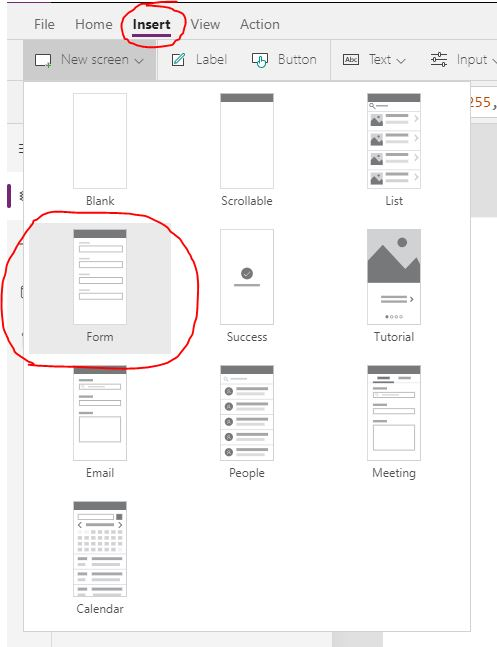

Then add the Signature entity as a data source for the edit form.

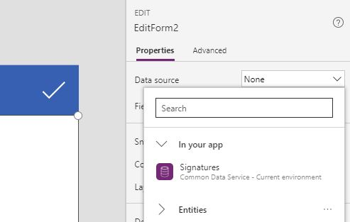

Next, confgiure the fields for your edit form to include the Signature Image field and the Signature Date fields.

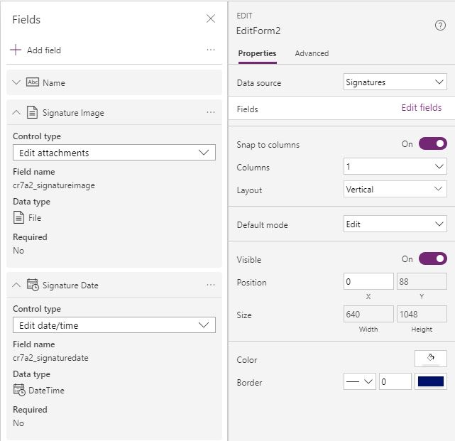

In this case, we want to make sure the edit form is only used for new entries.  Set the Edit Form's DefaultMode property to FormMode.New,

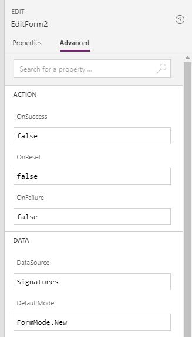

Now we want to specify the default value for the Signature Date field to be the current date and time.  First unlock the field properties for Signature Date,

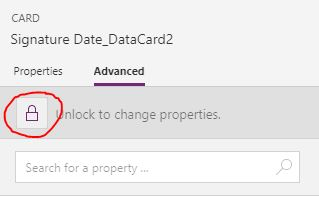

Now we can set the new Default property to "Now()",

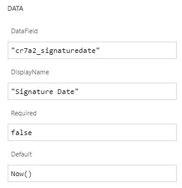

Next we want to modify the automated field for Signature Image.  Expand the controls for the Signature Image control card.  Then unlock the properties,

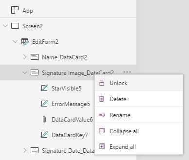

Remove all controls except the DataCardKey control,

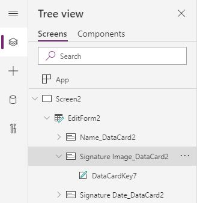

Add a Pen Ink control in the Signature Image data card control,

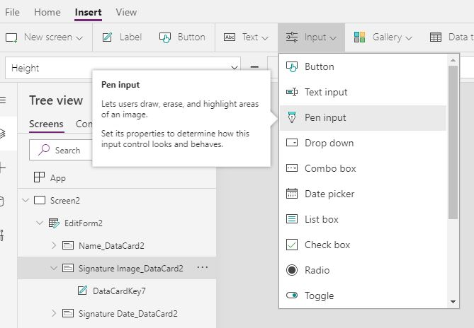

Resize the Pen Input control to fit better in the Edit Form,

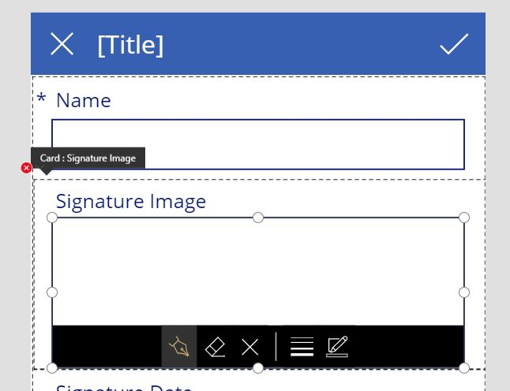

Now we need to set the Update property on the control to save back to the File field type.  To save to the File field type you need to specify two values.  The first is the filename (in this case I named it Signature.jpg).  You also need to save the image itself that is returned from the Pen Ink control.

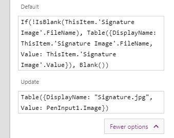

By default the Pen Ink control will show different ink styles and options.  If you want to not show those, you need to disable that in the ShowControls setting by changing it to "false",

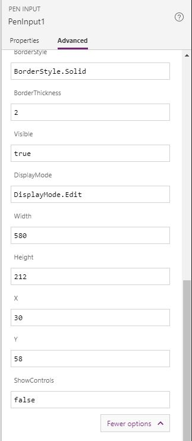

Your edit form should now look like this,

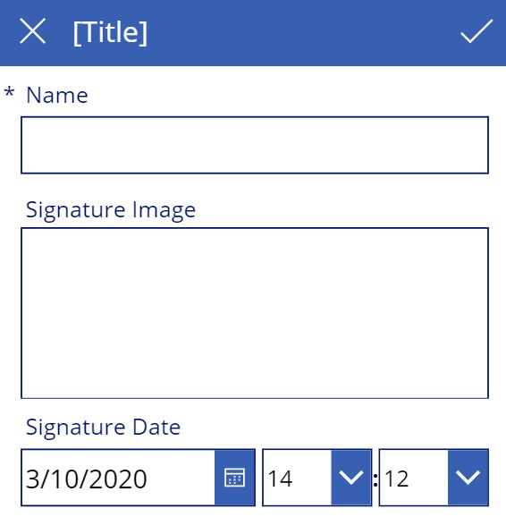

Lastly, click on the preivew icon in the upper right of the editor.  Fill out the form and click on the check icon.  This will now save your first entity that includes a digital signature!

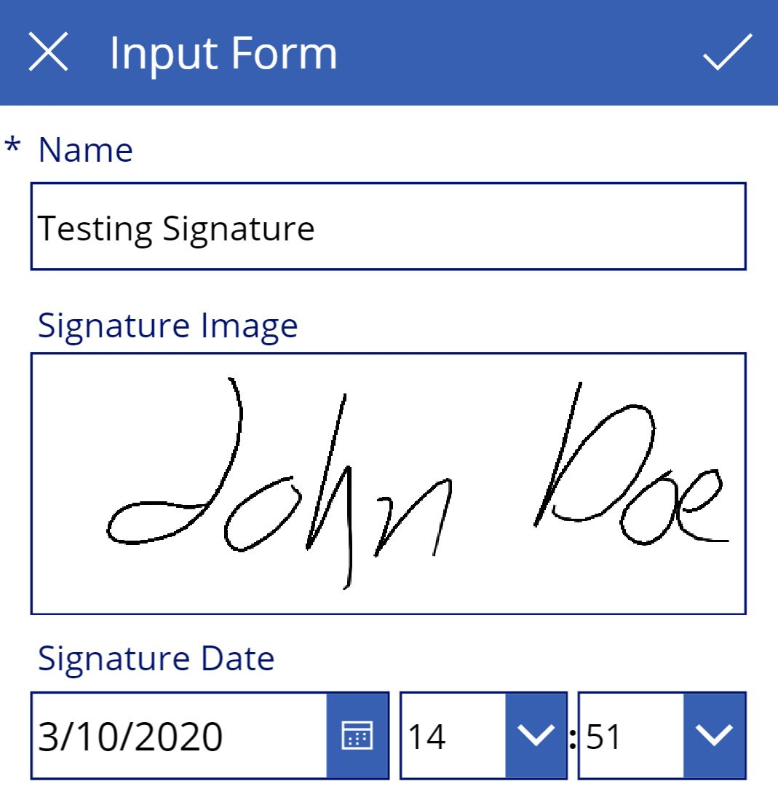

I created a completed canvas app and packaged it as a 
[solution](https://github.com/SteveWinward/PowerApps/raw/master/WriteUps/Samples/DigitalSignatureDemo_1_0_0_1.zip) if you want to play around with this more,

